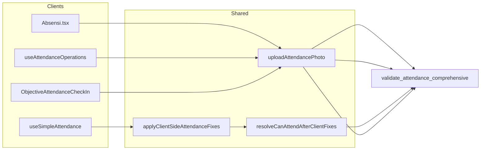

# Attendance Rules — Laporan Verifikasi

**Terakhir diperbarui:** 2026-05-30  
**Org demo:** `663c9336-8cb6-4a36-9ad9-313126e70a1a`  
**Karyawan uji:** OCTA `001b6725-bf16-4a2f-81ae-8960cf86c46d` (EMP-00001)  
**P3 QA sign-off:** [attendance-rules-qa-signoff.md](./attendance-rules-qa-signoff.md) — **PENDING MANUAL** (M1–M4, W1–W4)

---

## Status gap (P0 → P2)

| ID | Item | Status |
|----|------|--------|
| G1 | Mobile `Absensi.tsx` — foto ke RPC validate + upload storage | **RESOLVED (P0)** |
| G2 | `useAttendanceOperations` — auto-upload + validate/record path | **RESOLVED (P0)** |
| G3 | `useSimpleAttendance` — RPC authoritative + IP/face fixes terbatas | **RESOLVED (P1)** |
| G4 | Golden test shift override (WSS Sen–Jum + Sabtu) | **RESOLVED (P1)** — T08c/T08d, V11/V12 |
| G5 | `attendance-rules-verify.sql` — JWT + assert matrix | **RESOLVED (P2)** |
| G6 | OKR legacy check-in (`attendance` table) | **RESOLVED (P2)** — dead code removed; `ObjectiveAttendanceCheckIn` pakai hook shared |
| G7 | `useAttendanceValidation` legacy hook | **RESOLVED (P2)** — deleted |

---

## Cara re-run verifikasi

```bash
# Combo gate (fresh-demo + verify + unit tests + spot-check)
npm run verify:attendance-rules
```

QA manual prep / post / cleanup:

```bash
npm run supabase:db:push:attendance-rules-qa-prep
npm run supabase:db:push:attendance-rules-qa-post-check
npm run supabase:db:push:attendance-rules-qa-cleanup
```

Lihat urutan skenario dan checklist PASS/FAIL di [attendance-rules-qa-signoff.md](./attendance-rules-qa-signoff.md).

---

## Unit tests (client mirror)

| File | Coverage |
|------|----------|
| `attendanceRulesValidation.test.ts` | Mirror rules TS helpers |
| `resolveCanAttendAfterClientFixes.test.ts` | IP/face fix tidak longgarkan schedule/libur/GPS/foto |

---

## QA manual checklist (sign-off)

Checklist lengkap dengan kolom PASS/FAIL dan urutan eksekusi: **[attendance-rules-qa-signoff.md](./attendance-rules-qa-signoff.md)**.

| # | Skenario | Expected |
|---|----------|----------|
| M1 | Mobile clock-in di radius + foto | Sukses; file di `attendance-photos/{employeeId}/` |
| M3 | Mobile clock-out + foto | `check_out_photo_path` terisi |
| M4 | Mobile di luar radius | Toast lokasi invalid (RPC) |
| W1 | Web home check-in + foto | Sukses via `useSimpleAttendance` |
| W2 | Web desktop WiFi (IP allowed, GPS fail) | Lolos via IP fix; libur/jadwal tetap block |
| W3 | Web check-in hari libur enforce ON | Block meski IP OK |
| W4 | Web first check-in (face belum reg) | Auto-reg → re-validate → sukses |
| W5 | OKR `ObjectiveAttendanceCheckIn` | **N/A** — dormant (P3) |
| S1/S2 | `verify:attendance-rules` | fresh-demo + verify 12/12 + unit tests |
| P1 | `attendance-rules-qa-post-check.sql` | ALL PASS `_ar_qa_post` |

---

## Arsitektur client (post P2)



---

## Kesimpulan

**Backend + client paths utama sudah selaras** dengan Attendance Rules (foto wajib default ON, libur toggle, radius fallback, GPS, checkout photo, shift override).

**Sign-off produksi:** selesaikan checklist di [attendance-rules-qa-signoff.md](./attendance-rules-qa-signoff.md) (user OCTA + office `AR Fresh Demo HQ`). Status saat ini: **P3 QA PENDING MANUAL** — gate otomatis S1/S2 siap via `npm run verify:attendance-rules`.
