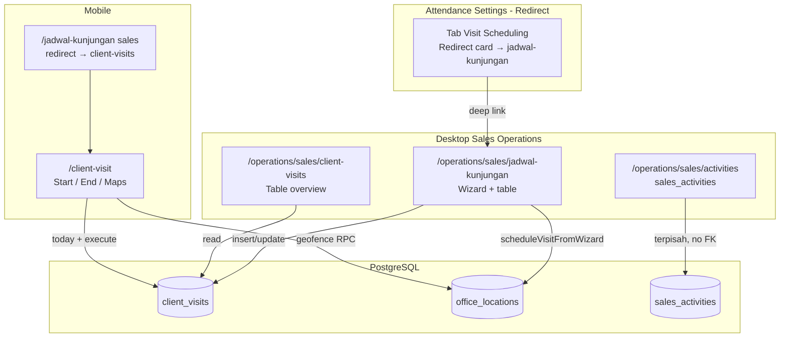

# Visit Scheduling — Flow Audit & Kesimpulan (2026-05-31)

**Org demo:** `663c9336-8cb6-4a36-9ad9-313126e70a1a` (Synckerja)  
**Gate otomatis:** `npm run verify:visit-scheduling` → **11/11 PASS** (fresh demo di-run ulang hari ini)  
**Unit test:** `scheduleVisitFromWizard.test.ts` → **3/3 PASS**

---

## 1. Peta integrasi (desktop ↔ mobile)



| Halaman | File utama | Data | Terintegrasi? |
|---------|------------|------|---------------|
| **Activities** | `SalesActivitiesPageContent` | `sales_activities` | Terpisah (demo row VS Fresh Demo ada; **bukan** sumber jadwal) |
| **Jadwal Kunjungan** | `VisitSchedulingPageContent` + `VisitSchedulingWizard` | `client_visits` + `office_locations` | **Sumber utama** create jadwal |
| **Client Visits (tab)** | `ClientVisitsPageContent` | `client_visits` (read) | **Mirror** jadwal; invalidasi query sama |
| **Settings → Visit Scheduling** | `VisitScheduling.tsx` | Redirect card + client site count | **Deep-link** ke jadwal-kunjungan |
| **Mobile Client Visit** | `ClientVisit.tsx` | `client_visits` hari ini + eksekusi | **Terintegrasi** start/end |
| **Mobile tab jadwal sales** | `SalesOperationsPage` redirect | → client-visits | **OK** |

---

## 2. Flow end-to-end (logika yang benar)

### A. Desktop — buat jadwal

1. Buka `/operations/sales/jadwal-kunjungan`
2. **New Visit** → `VisitSchedulingWizard`
3. `scheduleVisitFromWizard` → upsert `office_locations` (`is_client_location=true`) + insert `client_visits` (`status=scheduled`, `validated_location_id`)
4. Row muncul di tab **Jadwal** dan **Client Visits** (query invalidation)

### B. Mobile — eksekusi

1. Employee login (org demo + `profiles.active_organization_id` benar)
2. `/client-visit` → `useClientVisitData` load visit **by period filter** (default bulan ini) + today subset untuk active visit / notifications
3. **Start Visit** → GPS RPC `validate_client_visit_location` → UPDATE row `scheduled` → `ongoing` + `actual_start_time`
4. **End Visit** → geofence → `completed` + optional `SalesActivityModal` → insert `sales_activities` (terpisah)

### C. Activities

- Halaman activities menampilkan pipeline sales (`sales_activities`), **bukan** daftar jadwal kunjungan.
- Demo seed: 1 row `VS Fresh Demo — PT Maju Bersama` untuk uji UI activities saja.

---

## 3. Data demo fresh (setelah cleanup + re-seed)

**Command:** `npm run verify:visit-scheduling` (hapus data lama prefix `VS Fresh Demo`, seed ulang)

| ID visit | Employee | Tanggal | Status | Kegunaan QA |
|----------|----------|---------|--------|-------------|
| `…3301` | OCTA | **Hari ini** | `scheduled` | Mobile start + desktop jadwal hari ini |
| `…3302` | OCTA | Besok | `scheduled` | Filter jadwal desktop |
| `…3303` | OCTA | Kemarin | `completed` | History / metrics |
| `…3304` | Aidah | Hari ini | `cancelled` | Filter status |
| `…3305` | Aidah | Hari ini | `ongoing` | Timer / End Visit |

**Client:** `VS Fresh Demo — PT Maju Bersama`  
**Lokasi site:** `VS Fresh Demo Client Site — Grogol` — alamat `Grogol, Jakarta Barat`, koordinat `-6.1675, 106.7906`  
**Sales person site:** OCTA (`001b6725…`) — Aidah perlu org aktif demo + assignment jika uji notifikasi

**Akun uji:**

| User | Employee | Peran demo |
|------|----------|------------|
| OCTA | `001b6725-bf16-4a2f-81ae-8960cf86c46d` | Jadwal scheduled hari ini + start visit |
| Aidah | `485f1a2b-da0c-4464-8c22-ad9ca6e58942` | Ongoing + cancelled hari ini |

---

## 4. Hasil verify matrix (2026-05-31)

| Test | Hasil |
|------|-------|
| V01 Demo client | PASS |
| V02 OCTA scheduled today | PASS |
| V03 Join mirror hooks | PASS |
| V04 `in_progress` rejected | PASS |
| V05 Mobile execution columns | PASS |
| V06 createScheduledVisit shape | PASS |
| V07 Shared table count | PASS |
| V08 Location validate RPC | PASS |
| V09 sales_activities demo | PASS |
| V10 Status vocabulary `ongoing` | PASS |
| V11 scheduled → ongoing | PASS |

---

## 5. Temuan QA manual (sesi sebelumnya + code review)

| Item | Status | Catatan |
|------|--------|---------|
| Desktop jadwal + demo rows | PASS (user) | VS Fresh Demo tampil |
| Mobile start → ongoing | PASS (user) | |
| Geofence block jauh | PASS (expected) | ~21 km dari Grogol |
| Maps → Grogol | PASS (user) | Fix alamat-first + koordinat |
| Timer ongoing | PASS (fix) | backfill `actual_start_time` |
| Visit Notifications hide ongoing/completed today | **Implemented** | Section **Assigned Client Sites**; lokasi dengan visit hari ini `ongoing`/`completed` disembunyikan |
| Settings tab Visit Scheduling | **Redirect** | Card + CTA ke `/operations/sales/jadwal-kunjungan` (bukan mock John Doe) |

---

## 6. Kesimpulan

### Logika inti Visit Scheduling: **SUDAH BENAR** untuk production path

- **Satu sumber kebenaran jadwal:** `client_visits` (+ `validated_location_id` → `office_locations`)
- **Desktop create:** jadwal-kunjungan wizard ✅
- **Desktop read:** client-visits tab ✅ (sibling, bukan duplikat logic berbeda)
- **Mobile execute:** client-visit start/end ✅
- **Mobile jadwal sales:** redirect ✅
- **Geofence + RPC:** ✅
- **Gate otomatis:** 11/11 PASS

### Yang **sudah diperbaiki** (post-audit P1–P4, 2026-05-30)

**Tab `/attendance/settings` → Visit Scheduling** — mock diganti **redirect card** ke `/operations/sales/jadwal-kunjungan` (+ link opsional client-visits).

**Visit Notifications mobile** — rename **Assigned Client Sites**; sembunyikan lokasi dengan visit hari ini `ongoing`/`completed` (`scheduled`/`cancelled` tetap tampil).

**Period filter mobile** — `useClientVisitData` query by date range (`gte`/`lte` `visit_date`); refetch saat filter berubah.

**Dead code** — hapus `VisitSchedulingList`, `VisitSchedulingForm`, `LocationVisitScheduler`, stale `main-app-port/TodayVisitSchedule`.

### Yang **TIDAK** perlu dipertahankan (historical)

Mock John Doe / Jane Smith di Settings — **sudah diganti redirect**.

### Yang terpisah by design (bukan bug)

- **`sales_activities`** di `/operations/sales/activities` — pipeline sales, bukan jadwal; post-visit mobile bisa insert terpisah.
- **Visit Notifications** mobile — daftar **lokasi client site** yang di-assign; lokasi selesai/berlangsung hari ini disembunyikan setelah start/end.

---

## 7. Plan perbaikan (best practice)

### P1 — Settings redirect ✅ **IMPLEMENTED**

| Task | Status |
|------|--------|
| Redirect card | `VisitScheduling.tsx` → CTA ke jadwal-kunjungan + client-visits |
| Tab retained | Entry `visit-scheduling` di `AttendanceSettingsLayout.tsx` tetap ada |
| Cleanup | `LocationVisitScheduler.tsx` dihapus |

### P2 — UX mobile Visit Notifications ✅ **IMPLEMENTED**

| Task | Status |
|------|--------|
| Rename section | **Assigned Client Sites** / **Lokasi Client Ditugaskan** |
| Sembunyikan lokasi | `ongoing`/`completed` hari ini hidden via `shouldShowLocationInNotifications` |

### P3 — Period filter mobile ✅ **IMPLEMENTED**

| Task | Status |
|------|--------|
| `useClientVisitData` | Query `.gte`/`.lte` `visit_date` by `dateRange`; refetch on filter change |
| Today subset | Fetch today terpisah bila period tidak include hari ini (active visit + notifications) |

### P4 — Dead code desktop ✅ **IMPLEMENTED**

| File | Status |
|------|--------|
| `VisitSchedulingList.tsx`, `VisitSchedulingForm.tsx` | **Deleted** |
| `main-app-port/components/TodayVisitSchedule.tsx` | **Deleted** (canonical: `1-client-visit/components/TodayVisitSchedule.tsx`) |

### P5 — Integrasi Activities (future)

| Task | Detail |
|------|--------|
| FK optional | `sales_activities.client_visit_id` → link post-visit activity ke row jadwal |
| Payment modal | Enable setelah FK + payment schema jelas |

---

## 8. Checklist QA manual (post fresh demo)

```text
[ ] Desktop jadwal: filter hari ini → OCTA scheduled 09:00–11:00 VS Fresh Demo
[ ] Desktop client-visits tab: row sama muncul
[ ] Wizard New Visit → row baru + lokasi client site
[ ] Settings Visit Scheduling: redirect card → klik CTA → landing jadwal-kunjungan
[ ] Mobile OCTA: Visit Schedule (This Month) tampil kemarin/besok/hari ini; Start → ongoing; timer jalan
[ ] Mobile OCTA: Assigned Client Sites — scheduled card → Start → card hilang (ongoing)
[ ] Mobile Aidah: ongoing row; End geofence (onsite vs jauh)
[ ] Activities: 1 row VS Fresh Demo (terpisah dari client_visits)
```

---

## 9. Perintah re-run

```bash
npm run verify:visit-scheduling
npm test -- src/shared/lib/sales/scheduleVisitFromWizard.test.ts
```

Lihat juga: [`visit-scheduling-audit-report.md`](./visit-scheduling-audit-report.md) (ringkasan P0–P2 implementasi).
